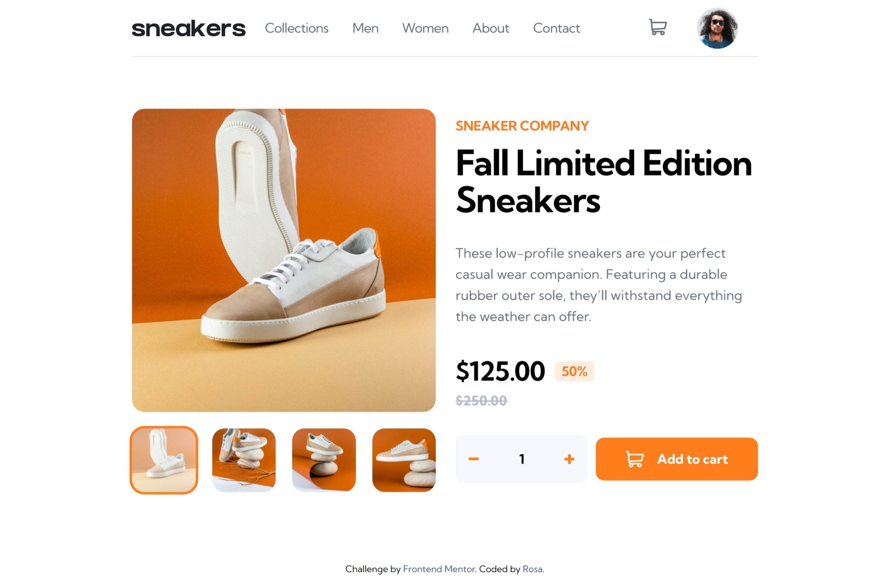
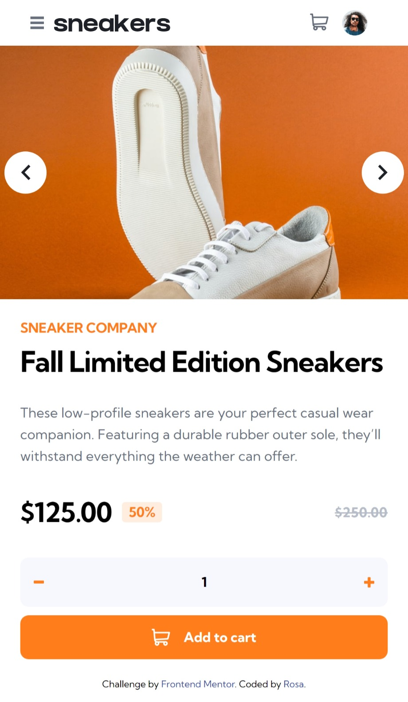

# Frontend Mentor - E-commerce product page solution

This is a solution to the [E-commerce product page challenge on Frontend Mentor](https://www.frontendmentor.io/challenges/ecommerce-product-page-UPsZ9MJp6). Frontend Mentor challenges help you improve your coding skills by building realistic projects.

## Table of contents
- [Frontend Mentor - E-commerce product page solution](#frontend-mentor---e-commerce-product-page-solution)
  - [Table of contents](#table-of-contents)
  - [Overview](#overview)
    - [The challenge](#the-challenge)
    - [Screenshot](#screenshot)
    - [Links](#links)
    - [Built with](#built-with)
    - [What I learned](#what-i-learned)
    - [Continued development](#continued-development)
  - [Author](#author)

**Note: Delete this note and update the table of contents based on what sections you keep.**

## Overview
Hi, I am Rosa. It's my first time using TypeScript be my type checker tool. I am still learning this stuff, and it's a bit harder than I thought.🥺 Any feedback is appreciated.

### The challenge
Users should be able to:

- [X] View the optimal layout for the site depending on their device's screen size
- [X] See hover states for all interactive elements on the page
- [X] Open a lightbox gallery by clicking on the large product image
- [X] Switch the large product image by clicking on the small thumbnail images
- [X] Add items to the cart
- [X] View the cart and remove items from it

Others : 
- [X] Cart data can be persist in Session storage
- [X] Auto playing Carousel
- [X] Custom mouse animation make the carousel be aware of be clicked

### Screenshot
- Desktop

- Mobile

### Links
- 👉 Solution URL: [solution URL](https://your-solution-url.com)
- 👉 Live Site URL: [e-commerce-product-page](https://meitung473.github.io/e-commerce-product-page/)

### Built with

- Semantic HTML5 markup
- Flexbox
- Mobile-first workflow
- [React](https://reactjs.org/) - JS library
- [Styled Components](https://styled-components.com/) - For styles
- [TypeScript](https://www.typescriptlang.org/) -  type checker
- [Vite](https://vitejs.dev/) - fast bundle tool
- [framer motion](https://www.framer.com/developers/) - React Animation library

### What I learned
1. how to write TypesScript type 
2. organize folder structure

### Continued development
- [ ] Animation : press "Add to Cart" CTA button and a circle fly to header navigation cart icon. 

## Author

- Website - [My Blog](https://blog.rosa.tw) (Chinese)
- Frontend Mentor - [@meitung473](https://www.frontendmentor.io/profile/meitung473)

